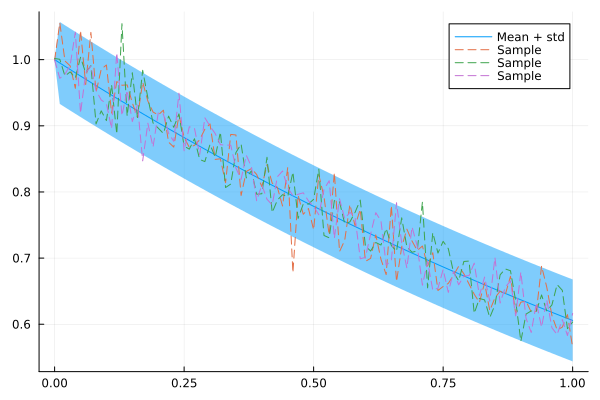
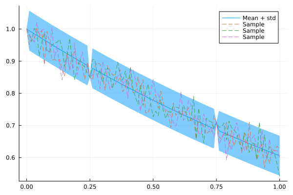
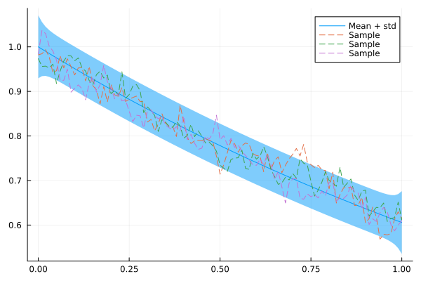
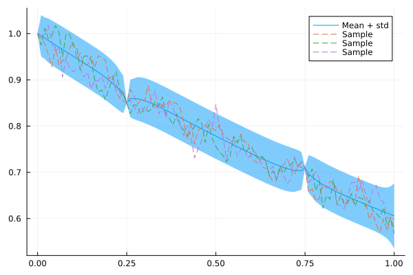

# Building autoregressive models {#Building-autoregressive-models}

## Introduction {#Introduction}

In the following, we will construct a _first-order auto-regressive model_ with Gaussian errors. Mathematically, this is expressed by

$$x_0 \sim \mathcal{N}(\mu_0, \Lambda_0), \\
x_{t+1} = \phi x_t + \varepsilon_t, \quad \varepsilon \sim \mathcal{N}(0, \Lambda).$$

The latter equation is equivalent to the likelihood

$$x_{t+1} \mid x_t \sim \mathcal{N}(\phi x_t, \Lambda).$$

Under this model, the joint distribution over $x_1, \dots, x_N$ (where $N$ is the number of steps) is Gaussian:

$$\begin{pmatrix} x_0 \\ x_1 \\ x_2 \\ \vdots \\ x_{N-1} \\ x_N \end{pmatrix}
\sim \mathcal{N}\left(
\begin{pmatrix} \mu_0 \\ \phi \mu_0 \\ \phi^2 \mu_0 \\ \vdots \\
\phi^{N-1} \mu_0 \\ \phi^N \mu_0 \end{pmatrix},
\begin{pmatrix} \Lambda_0 & -\phi & & & & & \\
-\phi & \Lambda + \phi^2 & -\phi & & & & \\
& & & & & & \\
& & \ddots & \ddots & \ddots & & \\
& & & & & & \\
& & & & -\phi & \Lambda + \phi^2 & -\phi \\
& & & & & -\phi & \Lambda
\end{pmatrix}^{-1}
\right).$$

The first-order Markov structure of the model results in a tridiagonal precision matrix. Thus, if we work with this Gaussian distribution in precision form (also commonly called _information form_), we gain tremendous computational benefits. By contrast, the _covariance matrix_ of this Gaussian is fully dense.

More generally, this package deals with _any_ sparse precision matrix, not just tridiagonal ones. Such Gaussians with sparse precision matrices are called _GMRFs_ (short for Gaussian Markov Random Fields).

In the following, we construct a GMRF for the above first-order autoregressive model first manually by computing the mean and precision, and then automatically by simply specifying the parameters of the model.

## Building an AR(1) model {#Building-an-AR1-model}

We begin by loading `GaussianMarkovRandomFields` and `LinearAlgebra`.

```julia
using GaussianMarkovRandomFields, LinearAlgebra, SparseArrays
```


We define a discretization of the real interval $[0, 1]$, and specify some example parameters for the AR(1) model:

```julia
xs = 0:0.01:1
N = length(xs)
ϕ = 0.995
Λ₀ = 1.0e6
Λ = 1.0e3
```


```ansi
1000.0
```


Now we compute the mean and the precision matrix of the joint distribution. We explicitly declare the precision matrix as a symmetric tridiagonal matrix, which unlocks highly efficient linear algebra routines for the underlying computations.

```julia
μ = [ϕ^(i - 1) for i in eachindex(xs)]
main_diag = [[Λ₀]; repeat([Λ + ϕ^2], N - 2); [Λ]]
off_diag = repeat([-ϕ], N - 1)
Q = sparse(SymTridiagonal(main_diag, off_diag))
x = GMRF(μ, Q)
```


```ansi
GMRF{Float64} with 101 variables
  Algorithm: LinearSolve.DefaultLinearSolver
  Mean: [1.0, 0.995, 0.990025, 0.985074875, 0.980149500625, 0.975248753121875, 0.9703725093562656, 0.9655206468094842, 0.9606930435754368, 0.9558895783575596, 0.9511101304657719, 0.946354579813443, 0.9416228069143757, 0.9369146928798039, 0.9322301194154049, 0.9275689688183278, 0.9229311239742362, 0.918316468354365, 0.9137248860125932, 0.9091562615825302, 0.9046104802746175, 0.9000874278732445, 0.8955869907338783, 0.8911090557802088, 0.8866535105013078, 0.8822202429488012, 0.8778091417340572, 0.873420096025387, 0.86905299554526, 0.8647077305675337, 0.8603841919146961, 0.8560822709551226, 0.8518018596003469, 0.8475428503023452, 0.8433051360508335, 0.8390886103705792, 0.8348931673187264, 0.8307187014821328, 0.826565107974722, 0.8224322824348484, 0.8183201210226743, 0.8142285204175609, 0.810157377815473, 0.8061065909263957, 0.8020760579717637, 0.7980656776819048, 0.7940753492934953, 0.7901049725470278, 0.7861544476842928, 0.7822236754458712, 0.7783125570686419, 0.7744209942832987, 0.7705488893118821, 0.7666961448653228, 0.7628626641409961, 0.7590483508202912, 0.7552531090661897, 0.7514768435208588, 0.7477194593032545, 0.7439808620067382, 0.7402609576967045, 0.736559652908221, 0.7328768546436799, 0.7292124703704614, 0.7255664080186092, 0.7219385759785161, 0.7183288830986235, 0.7147372386831304, 0.7111635524897147, 0.7076077347272661, 0.7040696960536298, 0.7005493475733616, 0.6970466008354949, 0.6935613678313174, 0.6900935609921608, 0.6866430931872, 0.683209877721264, 0.6797938283326577, 0.6763948591909944, 0.6730128848950394, 0.6696478204705641, 0.6662995813682113, 0.6629680834613703, 0.6596532430440635, 0.6563549768288431, 0.6530732019446989, 0.6498078359349754, 0.6465587967553006, 0.6433260027715241, 0.6401093727576664, 0.6369088258938781, 0.6337242817644086, 0.6305556603555866, 0.6274028820538087, 0.6242658676435396, 0.6211445383053219, 0.6180388156137954, 0.6149486215357264, 0.6118738784280477, 0.6088145090359075, 0.6057704364907279]
  Q_sqrt: not available
```


A GMRF is a multivariate Gaussian, and it&#39;s compatible with `Distributions.jl`. We can get its mean, marginal standard deviation, and draw samples as follows:

```julia
using Plots, Distributions
plot(xs, mean(x), ribbon = 1.96 * std(x), label = "Mean + std")
for i in 1:3
    plot!(xs, rand(x), fillalpha = 0.3, linestyle = :dash, label = "Sample")
end
plot!()
```

{width=600px height=400px}

Great! Looks like an AR(1) model.

But what can you do with this? Well, for example you can use it as a prior for Bayesian inference. If we have a likelihood of the form

$$y \mid x \sim \mathcal{N}(Ax, \Lambda_{\text{obs}}^{-1}),$$

then the posterior conditioned on these observations is again a GMRF, the moments of which we can compute in closed form. In terms of code, we achieve this through `condition_on_observations`. Let&#39;s condition our model on the observations $x_{26} = 0.85$ and $x_{76} = 0.71$:

```julia
using SparseArrays
A = spzeros(2, N)
A[1, 26] = 1.0
A[2, 76] = 1.0
y = [0.85, 0.71]
Λ_obs = 1.0e6
x_cond = condition_on_observations(x, A, Λ_obs, y)
```


```ansi
GMRF{Float64} with 101 variables
  Algorithm: LinearSolve.DefaultLinearSolver
  Mean: [1.0, 0.9949999999999999, 0.990025, 0.9850748749999999, 0.9801495006249998, 0.9752487531218749, 0.9703725093562654, 0.965520646809484, 0.9606930435754366, 0.9558895783575595, 0.9511101304657718, 0.9463545798134428, 0.9416228069143757, 0.9369146928798038, 0.9322301194154049, 0.9275689688183276, 0.9229311239742363, 0.9183164683543649, 0.913724886012593, 0.90915626158253, 0.9046104802746173, 0.9000874278732128, 0.8955869907022644, 0.8911090239762028, 0.8866215150629397, 0.8500322198263991, 0.8777771462956891, 0.873420064221381, 0.8690529955136463, 0.8647077305675023, 0.8603841919146961, 0.8560822709551225, 0.8518018596003469, 0.8475428503023452, 0.8433051360508335, 0.839088610370579, 0.8348931673187263, 0.8307187014821326, 0.8265651079747219, 0.8224322824348484, 0.8183201210226744, 0.8142285204175609, 0.8101573778154729, 0.8061065909263955, 0.8020760579717636, 0.7980656776819046, 0.7940753492934952, 0.7901049725470277, 0.7861544476842927, 0.7822236754458712, 0.778312557068642, 0.7744209942832985, 0.770548889311882, 0.7666961448653227, 0.762862664140996, 0.7590483508202912, 0.7552531090661897, 0.7514768435208588, 0.7477194593032545, 0.743980862006738, 0.7402609576967045, 0.7365596529082209, 0.7328768546436798, 0.7292124703704614, 0.7255664080186092, 0.7219385759785161, 0.7183288830986234, 0.7147372386831303, 0.7111635524897149, 0.7076077347272661, 0.7040696960536299, 0.7005493475733845, 0.6970466008584121, 0.6935613908864883, 0.6901167549349742, 0.70997664339515, 0.6832330716640774, 0.6797938513878283, 0.6763948592139115, 0.6730128848950622, 0.6696478204705641, 0.6662995813682113, 0.6629680834613702, 0.6596532430440634, 0.6563549768288429, 0.6530732019446989, 0.6498078359349752, 0.6465587967553005, 0.643326002771524, 0.6401093727576662, 0.6369088258938779, 0.6337242817644086, 0.6305556603555865, 0.6274028820538086, 0.6242658676435396, 0.6211445383053218, 0.6180388156137954, 0.6149486215357262, 0.6118738784280477, 0.6088145090359075, 0.6057704364907279]
  Q_sqrt: not available
```


Indeed, our model now conforms to these observations:

```julia
plot(xs, mean(x_cond), ribbon = 1.96 * std(x_cond), label = "Mean + std")
for i in 1:3
    plot!(xs, rand(x_cond), fillalpha = 0.3, linestyle = :dash, label = "Sample")
end
plot!()
```

{width=600px height=400px}

## Beyond first-order models: CARs {#Beyond-first-order-models:-CARs}

You may have noticed that the AR(1) model above produces very rough samples. This may or may not be desirable, depending on the application. If we do want smoother samples, we can increase the _order_ of the model. This adds off-diagonals to the precision matrix and thus reduces its sparsity, so computations become a bit more expensive. But it may be worth the overhead.

One model class to produce autoregressive models with flexible conditional dependencies and sparse precision matrices is that of _conditional autoregressive models_ (_CAR_s). Such models are constructed based on a graph representation of the underlying data, where there is an edge between two nodes if they are conditionally dependent.

Let us construct an adjacency matrix that relates nodes not only to their immediate neighbors, but also to the neighbors&#39; neighbors (a second-order model).

```julia
W = spzeros(N, N)
for i in 1:N
    for k in [-2, -1, 1, 2]
        j = i + k
        if 1 <= j <= N
            W[i, j] = 1.0 / abs(k)
        end
    end
end
```


Now that we have the adjacency matrix, we can use a GaussianMarkovRandomFields.jl utility function to generate a CAR model from it, which internally constructs a slight variation of the graph Laplacian to form the precision matrix.

```julia
x_car = generate_car_model(W, 0.9; μ = μ, σ = 0.001)
```


```ansi
GMRF{Float64} with 101 variables
  Algorithm: LinearSolve.DefaultLinearSolver
  Mean: [1.0, 0.995, 0.990025, 0.985074875, 0.980149500625, 0.975248753121875, 0.9703725093562656, 0.9655206468094842, 0.9606930435754368, 0.9558895783575596, 0.9511101304657719, 0.946354579813443, 0.9416228069143757, 0.9369146928798039, 0.9322301194154049, 0.9275689688183278, 0.9229311239742362, 0.918316468354365, 0.9137248860125932, 0.9091562615825302, 0.9046104802746175, 0.9000874278732445, 0.8955869907338783, 0.8911090557802088, 0.8866535105013078, 0.8822202429488012, 0.8778091417340572, 0.873420096025387, 0.86905299554526, 0.8647077305675337, 0.8603841919146961, 0.8560822709551226, 0.8518018596003469, 0.8475428503023452, 0.8433051360508335, 0.8390886103705792, 0.8348931673187264, 0.8307187014821328, 0.826565107974722, 0.8224322824348484, 0.8183201210226743, 0.8142285204175609, 0.810157377815473, 0.8061065909263957, 0.8020760579717637, 0.7980656776819048, 0.7940753492934953, 0.7901049725470278, 0.7861544476842928, 0.7822236754458712, 0.7783125570686419, 0.7744209942832987, 0.7705488893118821, 0.7666961448653228, 0.7628626641409961, 0.7590483508202912, 0.7552531090661897, 0.7514768435208588, 0.7477194593032545, 0.7439808620067382, 0.7402609576967045, 0.736559652908221, 0.7328768546436799, 0.7292124703704614, 0.7255664080186092, 0.7219385759785161, 0.7183288830986235, 0.7147372386831304, 0.7111635524897147, 0.7076077347272661, 0.7040696960536298, 0.7005493475733616, 0.6970466008354949, 0.6935613678313174, 0.6900935609921608, 0.6866430931872, 0.683209877721264, 0.6797938283326577, 0.6763948591909944, 0.6730128848950394, 0.6696478204705641, 0.6662995813682113, 0.6629680834613703, 0.6596532430440635, 0.6563549768288431, 0.6530732019446989, 0.6498078359349754, 0.6465587967553006, 0.6433260027715241, 0.6401093727576664, 0.6369088258938781, 0.6337242817644086, 0.6305556603555866, 0.6274028820538087, 0.6242658676435396, 0.6211445383053219, 0.6180388156137954, 0.6149486215357264, 0.6118738784280477, 0.6088145090359075, 0.6057704364907279]
  Q_sqrt: not available
```


Let&#39;s take our CAR for a test drive:

```julia
plot(xs, mean(x_car), ribbon = 1.96 * std(x_car), label = "Mean + std")
for i in 1:3
    plot!(xs, rand(x_car), fillalpha = 0.3, linestyle = :dash, label = "Sample")
end
plot!()
```

{width=600px height=400px}

Let&#39;s see how this model fits data. We take the same observations as for the AR(1) model, but also add an observation for the starting point to reduce the uncertainty there.

```julia
A = spzeros(3, N)
A[1, 1] = 1.0
A[2, 26] = 1.0
A[3, 76] = 1.0
y = [1.0, 0.85, 0.71]
Λ_obs = 1.0e6
x_car_cond = condition_on_observations(x_car, A, Λ_obs, y)
plot(xs, mean(x_car_cond), ribbon = 1.96 * std(x_car_cond), label = "Mean + std")
for i in 1:3
    plot!(xs, rand(x_car_cond), fillalpha = 0.3, linestyle = :dash, label = "Sample")
end
plot!()
```

{width=600px height=400px}

As expected, the interpolation of this model is less abrupt and spiky than for the AR(1) model.

## Outlook {#Outlook}

CAR models are quite flexible. Particularly for spatial data however, it is more common to model continuously through a Gaussian process. Fortunately, it turns out that popular Gaussian processes can be approximated quite nicely through GMRFs, allowing us to do the modelling in terms of a GP and the computations in terms of a GMRF. To learn more about this approach, check the tutorial on [Spatial Modelling with SPDEs](/tutorials/spatial_modelling_spdes#Spatial-Modelling-with-SPDEs).


---


_This page was generated using [Literate.jl](https://github.com/fredrikekre/Literate.jl)._
