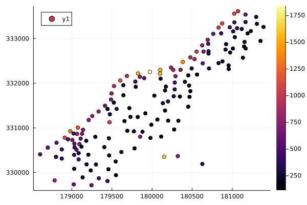
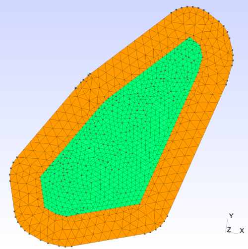
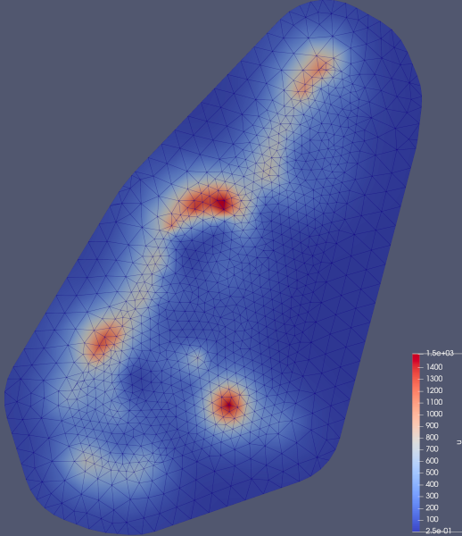
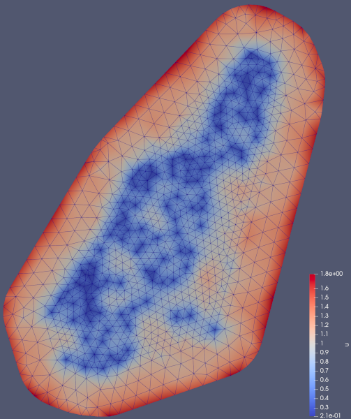

# Spatial Modelling with SPDEs {#Spatial-Modelling-with-SPDEs}

## Data preprocessing {#Data-preprocessing}

In the following, we are going to work with the `meuse` dataset. This dataset contains measurements of zinc concentrations in the soil near the Meuse river.

We begin by downloading the dataset.

```julia
meuse_path = joinpath(@__DIR__, "meuse.csv")
meuse_URL = "https://gist.githubusercontent.com/essicolo/91a2666f7c5972a91bca763daecdc5ff/raw/056bda04114d55b793469b2ab0097ec01a6d66c6/meuse.csv"
download(meuse_URL, meuse_path)
```


```ansi
"/home/runner/work/GaussianMarkovRandomFields.jl/GaussianMarkovRandomFields.jl/docs/build/tutorials/meuse.csv"
```


We load the CSV file into a DataFrame and inspect the first few rows.

```julia
using CSV, DataFrames
df = DataFrame(CSV.File(meuse_path))
df[1:5, [:x, :y, :zinc]]
```

<div v-html="`&lt;div&gt;&lt;div style = &quot;float: left;&quot;&gt;&lt;span&gt;5×3 DataFrame&lt;/span&gt;&lt;/div&gt;&lt;div style = &quot;clear: both;&quot;&gt;&lt;/div&gt;&lt;/div&gt;&lt;div class = &quot;data-frame&quot; style = &quot;overflow-x: scroll;&quot;&gt;&lt;table class = &quot;data-frame&quot; style = &quot;margin-bottom: 6px;&quot;&gt;&lt;thead&gt;&lt;tr class = &quot;header&quot;&gt;&lt;th class = &quot;rowNumber&quot; style = &quot;font-weight: bold; text-align: right;&quot;&gt;Row&lt;/th&gt;&lt;th style = &quot;text-align: left;&quot;&gt;x&lt;/th&gt;&lt;th style = &quot;text-align: left;&quot;&gt;y&lt;/th&gt;&lt;th style = &quot;text-align: left;&quot;&gt;zinc&lt;/th&gt;&lt;/tr&gt;&lt;tr class = &quot;subheader headerLastRow&quot;&gt;&lt;th class = &quot;rowNumber&quot; style = &quot;font-weight: bold; text-align: right;&quot;&gt;&lt;/th&gt;&lt;th title = &quot;Int64&quot; style = &quot;text-align: left;&quot;&gt;Int64&lt;/th&gt;&lt;th title = &quot;Int64&quot; style = &quot;text-align: left;&quot;&gt;Int64&lt;/th&gt;&lt;th title = &quot;Int64&quot; style = &quot;text-align: left;&quot;&gt;Int64&lt;/th&gt;&lt;/tr&gt;&lt;/thead&gt;&lt;tbody&gt;&lt;tr&gt;&lt;td class = &quot;rowNumber&quot; style = &quot;font-weight: bold; text-align: right;&quot;&gt;1&lt;/td&gt;&lt;td style = &quot;text-align: right;&quot;&gt;181072&lt;/td&gt;&lt;td style = &quot;text-align: right;&quot;&gt;333611&lt;/td&gt;&lt;td style = &quot;text-align: right;&quot;&gt;1022&lt;/td&gt;&lt;/tr&gt;&lt;tr&gt;&lt;td class = &quot;rowNumber&quot; style = &quot;font-weight: bold; text-align: right;&quot;&gt;2&lt;/td&gt;&lt;td style = &quot;text-align: right;&quot;&gt;181025&lt;/td&gt;&lt;td style = &quot;text-align: right;&quot;&gt;333558&lt;/td&gt;&lt;td style = &quot;text-align: right;&quot;&gt;1141&lt;/td&gt;&lt;/tr&gt;&lt;tr&gt;&lt;td class = &quot;rowNumber&quot; style = &quot;font-weight: bold; text-align: right;&quot;&gt;3&lt;/td&gt;&lt;td style = &quot;text-align: right;&quot;&gt;181165&lt;/td&gt;&lt;td style = &quot;text-align: right;&quot;&gt;333537&lt;/td&gt;&lt;td style = &quot;text-align: right;&quot;&gt;640&lt;/td&gt;&lt;/tr&gt;&lt;tr&gt;&lt;td class = &quot;rowNumber&quot; style = &quot;font-weight: bold; text-align: right;&quot;&gt;4&lt;/td&gt;&lt;td style = &quot;text-align: right;&quot;&gt;181298&lt;/td&gt;&lt;td style = &quot;text-align: right;&quot;&gt;333484&lt;/td&gt;&lt;td style = &quot;text-align: right;&quot;&gt;257&lt;/td&gt;&lt;/tr&gt;&lt;tr&gt;&lt;td class = &quot;rowNumber&quot; style = &quot;font-weight: bold; text-align: right;&quot;&gt;5&lt;/td&gt;&lt;td style = &quot;text-align: right;&quot;&gt;181307&lt;/td&gt;&lt;td style = &quot;text-align: right;&quot;&gt;333330&lt;/td&gt;&lt;td style = &quot;text-align: right;&quot;&gt;269&lt;/td&gt;&lt;/tr&gt;&lt;/tbody&gt;&lt;/table&gt;&lt;/div&gt;`"></div>

Let us visualize the data. We plot the zinc concentrations as a function of the x and y coordinates.

```julia
using Plots
x = convert(Vector{Float64}, df[:, :x])
y = convert(Vector{Float64}, df[:, :y])
zinc = df[:, :zinc]
scatter(x, y, zcolor = zinc)
```

{width=600px height=400px}

Finally, in classic machine learning fashion, we split the data into a training and a test set. We use about 85% of the data for training and the remaining 15% for testing.

```julia
using Random
train_idcs = randsubseq(1:size(df, 1), 0.85)
test_idcs = [i for i in 1:size(df, 1) if isempty(searchsorted(train_idcs, i))]
X = [x y]
X_train = X[train_idcs, :]
X_test = X[test_idcs, :]
y_train = zinc[train_idcs]
y_test = zinc[test_idcs]
size(X_train, 1), size(X_test, 1)
```


```ansi
(140, 15)
```


## Spatial Modelling {#Spatial-Modelling}

Matern Gaussian processes (GPs) are a powerful model class commonly used in geostatistics for such data. Unfortunately, without using any further tricks, GPs have a cubic runtime complexity. As the size of the dataset grows, this quickly becomes prohibitively expensive. In the tutorial on Autoregressive models, we learned that GMRFs enable highly efficient Gaussian inference through sparse precision matrices. Can we combine the modelling power of GPs with the efficiency of GMRFs?

Yes, we can: [[1](/bibliography#Lindgren2011)] told us how. It turns out that Matern processes may equivalently be interpreted as solutions of certain stochastic partial differential equations (SPDEs). If we discretize this SPDE appropriately – for example using the finite element method (FEM) – we get a discrete GMRF approximation of a Matern process. The approximation quality improves as the resolution of the FEM mesh increases. If this all sounds overly complicated to you, fear not! GaussianMarkovRandomFields.jl takes care of the technical details for you, so you can focus on the modelling.

We start by generating a FEM mesh for our data. Internally, GaussianMarkovRandomFields.jl computes a convex hull around the scattered data and then extends it slightly to counteract effects from the boundary condition of the SPDE.





The final output is a Ferrite.jl grid. We can also save the generated mesh, e.g. to visualize it via Gmsh.

```julia
using GaussianMarkovRandomFields
points = zip(x, y)
grid = generate_mesh(points, 600.0, 100.0, save_path = "meuse.msh")
```


```ansi
Grid{2, Triangle, Float64} with 2143 Triangle cells and 1119 nodes
```


We can now create a FEM discretization, which consists of the grid, a choice of basis functions, and a quadrature rule.

```julia
using Ferrite
ip = Lagrange{RefTriangle, 1}()
qr = QuadratureRule{RefTriangle}(2)
disc = FEMDiscretization(grid, ip, qr)
```


```ansi
FEMDiscretization
  grid: Grid{2, Triangle, Float64} with 2143 Triangle cells and 1119 nodes
  interpolation: Lagrange{RefTriangle, 1}()
  quadrature_rule: QuadratureRule{RefTriangle, Vector{Float64}, Vector{Vec{2, Float64}}}
  # constraints: 0

```


We now create a Matern SPDE and discretize it. While we could specify the Matern SPDE in terms of its direct parameters κ and ν, we here choose to specify it through the more easily interpretable parameters `range` and `smoothness`.

```julia
spde = MaternSPDE{2}(range = 400.0, smoothness = 1)
u_matern = discretize(spde, disc)
```


```ansi
GMRF{Float64} with 1119 variables
  Algorithm: LinearSolve.DefaultLinearSolver
  Mean: [0.0, 0.0, 0.0, 0.0, 0.0, 0.0, 0.0, 0.0, 0.0, 0.0, 0.0, 0.0, 0.0, 0.0, 0.0, 0.0, 0.0, 0.0, 0.0, 0.0, 0.0, 0.0, 0.0, 0.0, 0.0, 0.0, 0.0, 0.0, 0.0, 0.0, 0.0, 0.0, 0.0, 0.0, 0.0, 0.0, 0.0, 0.0, 0.0, 0.0, 0.0, 0.0, 0.0, 0.0, 0.0, 0.0, 0.0, 0.0, 0.0, 0.0, 0.0, 0.0, 0.0, 0.0, 0.0, 0.0, 0.0, 0.0, 0.0, 0.0, 0.0, 0.0, 0.0, 0.0, 0.0, 0.0, 0.0, 0.0, 0.0, 0.0, 0.0, 0.0, 0.0, 0.0, 0.0, 0.0, 0.0, 0.0, 0.0, 0.0, 0.0, 0.0, 0.0, 0.0, 0.0, 0.0, 0.0, 0.0, 0.0, 0.0, 0.0, 0.0, 0.0, 0.0, 0.0, 0.0, 0.0, 0.0, 0.0, 0.0, 0.0, 0.0, 0.0, 0.0, 0.0, 0.0, 0.0, 0.0, 0.0, 0.0, 0.0, 0.0, 0.0, 0.0, 0.0, 0.0, 0.0, 0.0, 0.0, 0.0, 0.0, 0.0, 0.0, 0.0, 0.0, 0.0, 0.0, 0.0, 0.0, 0.0, 0.0, 0.0, 0.0, 0.0, 0.0, 0.0, 0.0, 0.0, 0.0, 0.0, 0.0, 0.0, 0.0, 0.0, 0.0, 0.0, 0.0, 0.0, 0.0, 0.0, 0.0, 0.0, 0.0, 0.0, 0.0, 0.0, 0.0, 0.0, 0.0, 0.0, 0.0, 0.0, 0.0, 0.0, 0.0, 0.0, 0.0, 0.0, 0.0, 0.0, 0.0, 0.0, 0.0, 0.0, 0.0, 0.0, 0.0, 0.0, 0.0, 0.0, 0.0, 0.0, 0.0, 0.0, 0.0, 0.0, 0.0, 0.0, 0.0, 0.0, 0.0, 0.0, 0.0, 0.0, 0.0, 0.0, 0.0, 0.0, 0.0, 0.0, 0.0, 0.0, 0.0, 0.0, 0.0, 0.0, 0.0, 0.0, 0.0, 0.0, 0.0, 0.0, 0.0, 0.0, 0.0, 0.0, 0.0, 0.0, 0.0, 0.0, 0.0, 0.0, 0.0, 0.0, 0.0, 0.0, 0.0, 0.0, 0.0, 0.0, 0.0, 0.0, 0.0, 0.0, 0.0, 0.0, 0.0, 0.0, 0.0, 0.0, 0.0, 0.0, 0.0, 0.0, 0.0, 0.0, 0.0, 0.0, 0.0, 0.0, 0.0, 0.0, 0.0, 0.0, 0.0, 0.0, 0.0, 0.0, 0.0, 0.0, 0.0, 0.0, 0.0, 0.0, 0.0, 0.0, 0.0, 0.0, 0.0, 0.0, 0.0, 0.0, 0.0, 0.0, 0.0, 0.0, 0.0, 0.0, 0.0, 0.0, 0.0, 0.0, 0.0, 0.0, 0.0, 0.0, 0.0, 0.0, 0.0, 0.0, 0.0, 0.0, 0.0, 0.0, 0.0, 0.0, 0.0, 0.0, 0.0, 0.0, 0.0, 0.0, 0.0, 0.0, 0.0, 0.0, 0.0, 0.0, 0.0, 0.0, 0.0, 0.0, 0.0, 0.0, 0.0, 0.0, 0.0, 0.0, 0.0, 0.0, 0.0, 0.0, 0.0, 0.0, 0.0, 0.0, 0.0, 0.0, 0.0, 0.0, 0.0, 0.0, 0.0, 0.0, 0.0, 0.0, 0.0, 0.0, 0.0, 0.0, 0.0, 0.0, 0.0, 0.0, 0.0, 0.0, 0.0, 0.0, 0.0, 0.0, 0.0, 0.0, 0.0, 0.0, 0.0, 0.0, 0.0, 0.0, 0.0, 0.0, 0.0, 0.0, 0.0, 0.0, 0.0, 0.0, 0.0, 0.0, 0.0, 0.0, 0.0, 0.0, 0.0, 0.0, 0.0, 0.0, 0.0, 0.0, 0.0, 0.0, 0.0, 0.0, 0.0, 0.0, 0.0, 0.0, 0.0, 0.0, 0.0, 0.0, 0.0, 0.0, 0.0, 0.0, 0.0, 0.0, 0.0, 0.0, 0.0, 0.0, 0.0, 0.0, 0.0, 0.0, 0.0, 0.0, 0.0, 0.0, 0.0, 0.0, 0.0, 0.0, 0.0, 0.0, 0.0, 0.0, 0.0, 0.0, 0.0, 0.0, 0.0, 0.0, 0.0, 0.0, 0.0, 0.0, 0.0, 0.0, 0.0, 0.0, 0.0, 0.0, 0.0, 0.0, 0.0, 0.0, 0.0, 0.0, 0.0, 0.0, 0.0, 0.0, 0.0, 0.0, 0.0, 0.0, 0.0, 0.0, 0.0, 0.0, 0.0, 0.0, 0.0, 0.0, 0.0, 0.0, 0.0, 0.0, 0.0, 0.0, 0.0, 0.0, 0.0, 0.0, 0.0, 0.0, 0.0, 0.0, 0.0, 0.0, 0.0, 0.0, 0.0, 0.0, 0.0, 0.0, 0.0, 0.0, 0.0, 0.0, 0.0, 0.0, 0.0, 0.0, 0.0, 0.0, 0.0, 0.0, 0.0, 0.0, 0.0, 0.0, 0.0, 0.0, 0.0, 0.0, 0.0, 0.0, 0.0, 0.0, 0.0, 0.0, 0.0, 0.0, 0.0, 0.0, 0.0, 0.0, 0.0, 0.0, 0.0, 0.0, 0.0, 0.0, 0.0, 0.0, 0.0, 0.0, 0.0, 0.0, 0.0, 0.0, 0.0, 0.0, 0.0, 0.0, 0.0, 0.0, 0.0, 0.0, 0.0, 0.0, 0.0, 0.0, 0.0, 0.0, 0.0, 0.0, 0.0, 0.0, 0.0, 0.0, 0.0, 0.0, 0.0, 0.0, 0.0, 0.0, 0.0, 0.0, 0.0, 0.0, 0.0, 0.0, 0.0, 0.0, 0.0, 0.0, 0.0, 0.0, 0.0, 0.0, 0.0, 0.0, 0.0, 0.0, 0.0, 0.0, 0.0, 0.0, 0.0, 0.0, 0.0, 0.0, 0.0, 0.0, 0.0, 0.0, 0.0, 0.0, 0.0, 0.0, 0.0, 0.0, 0.0, 0.0, 0.0, 0.0, 0.0, 0.0, 0.0, 0.0, 0.0, 0.0, 0.0, 0.0, 0.0, 0.0, 0.0, 0.0, 0.0, 0.0, 0.0, 0.0, 0.0, 0.0, 0.0, 0.0, 0.0, 0.0, 0.0, 0.0, 0.0, 0.0, 0.0, 0.0, 0.0, 0.0, 0.0, 0.0, 0.0, 0.0, 0.0, 0.0, 0.0, 0.0, 0.0, 0.0, 0.0, 0.0, 0.0, 0.0, 0.0, 0.0, 0.0, 0.0, 0.0, 0.0, 0.0, 0.0, 0.0, 0.0, 0.0, 0.0, 0.0, 0.0, 0.0, 0.0, 0.0, 0.0, 0.0, 0.0, 0.0, 0.0, 0.0, 0.0, 0.0, 0.0, 0.0, 0.0, 0.0, 0.0, 0.0, 0.0, 0.0, 0.0, 0.0, 0.0, 0.0, 0.0, 0.0, 0.0, 0.0, 0.0, 0.0, 0.0, 0.0, 0.0, 0.0, 0.0, 0.0, 0.0, 0.0, 0.0, 0.0, 0.0, 0.0, 0.0, 0.0, 0.0, 0.0, 0.0, 0.0, 0.0, 0.0, 0.0, 0.0, 0.0, 0.0, 0.0, 0.0, 0.0, 0.0, 0.0, 0.0, 0.0, 0.0, 0.0, 0.0, 0.0, 0.0, 0.0, 0.0, 0.0, 0.0, 0.0, 0.0, 0.0, 0.0, 0.0, 0.0, 0.0, 0.0, 0.0, 0.0, 0.0, 0.0, 0.0, 0.0, 0.0, 0.0, 0.0, 0.0, 0.0, 0.0, 0.0, 0.0, 0.0, 0.0, 0.0, 0.0, 0.0, 0.0, 0.0, 0.0, 0.0, 0.0, 0.0, 0.0, 0.0, 0.0, 0.0, 0.0, 0.0, 0.0, 0.0, 0.0, 0.0, 0.0, 0.0, 0.0, 0.0, 0.0, 0.0, 0.0, 0.0, 0.0, 0.0, 0.0, 0.0, 0.0, 0.0, 0.0, 0.0, 0.0, 0.0, 0.0, 0.0, 0.0, 0.0, 0.0, 0.0, 0.0, 0.0, 0.0, 0.0, 0.0, 0.0, 0.0, 0.0, 0.0, 0.0, 0.0, 0.0, 0.0, 0.0, 0.0, 0.0, 0.0, 0.0, 0.0, 0.0, 0.0, 0.0, 0.0, 0.0, 0.0, 0.0, 0.0, 0.0, 0.0, 0.0, 0.0, 0.0, 0.0, 0.0, 0.0, 0.0, 0.0, 0.0, 0.0, 0.0, 0.0, 0.0, 0.0, 0.0, 0.0, 0.0, 0.0, 0.0, 0.0, 0.0, 0.0, 0.0, 0.0, 0.0, 0.0, 0.0, 0.0, 0.0, 0.0, 0.0, 0.0, 0.0, 0.0, 0.0, 0.0, 0.0, 0.0, 0.0, 0.0, 0.0, 0.0, 0.0, 0.0, 0.0, 0.0, 0.0, 0.0, 0.0, 0.0, 0.0, 0.0, 0.0, 0.0, 0.0, 0.0, 0.0, 0.0, 0.0, 0.0, 0.0, 0.0, 0.0, 0.0, 0.0, 0.0, 0.0, 0.0, 0.0, 0.0, 0.0, 0.0, 0.0, 0.0, 0.0, 0.0, 0.0, 0.0, 0.0, 0.0, 0.0, 0.0, 0.0, 0.0, 0.0, 0.0, 0.0, 0.0, 0.0, 0.0, 0.0, 0.0, 0.0, 0.0, 0.0, 0.0, 0.0, 0.0, 0.0, 0.0, 0.0, 0.0, 0.0, 0.0, 0.0, 0.0, 0.0, 0.0, 0.0, 0.0, 0.0, 0.0, 0.0, 0.0, 0.0, 0.0, 0.0, 0.0, 0.0, 0.0, 0.0, 0.0, 0.0, 0.0, 0.0, 0.0, 0.0, 0.0, 0.0, 0.0, 0.0, 0.0, 0.0, 0.0, 0.0, 0.0, 0.0, 0.0, 0.0, 0.0, 0.0, 0.0, 0.0, 0.0, 0.0, 0.0, 0.0, 0.0, 0.0, 0.0, 0.0, 0.0, 0.0, 0.0, 0.0, 0.0, 0.0, 0.0, 0.0, 0.0, 0.0, 0.0, 0.0, 0.0, 0.0, 0.0, 0.0, 0.0, 0.0, 0.0, 0.0, 0.0, 0.0, 0.0, 0.0, 0.0, 0.0, 0.0, 0.0, 0.0, 0.0, 0.0, 0.0, 0.0, 0.0, 0.0, 0.0, 0.0, 0.0, 0.0, 0.0, 0.0, 0.0, 0.0, 0.0, 0.0, 0.0, 0.0, 0.0, 0.0, 0.0, 0.0, 0.0, 0.0, 0.0, 0.0, 0.0, 0.0, 0.0, 0.0, 0.0, 0.0, 0.0, 0.0, 0.0, 0.0, 0.0, 0.0, 0.0, 0.0, 0.0, 0.0, 0.0, 0.0, 0.0, 0.0, 0.0, 0.0, 0.0, 0.0, 0.0, 0.0, 0.0, 0.0, 0.0, 0.0, 0.0, 0.0, 0.0, 0.0, 0.0, 0.0, 0.0, 0.0, 0.0, 0.0, 0.0, 0.0, 0.0, 0.0, 0.0, 0.0, 0.0, 0.0, 0.0, 0.0, 0.0, 0.0, 0.0, 0.0, 0.0, 0.0, 0.0, 0.0, 0.0, 0.0, 0.0, 0.0, 0.0, 0.0, 0.0, 0.0, 0.0, 0.0, 0.0, 0.0, 0.0, 0.0, 0.0, 0.0, 0.0, 0.0, 0.0, 0.0, 0.0, 0.0, 0.0, 0.0, 0.0, 0.0, 0.0, 0.0, 0.0, 0.0, 0.0, 0.0, 0.0, 0.0, 0.0, 0.0, 0.0, 0.0, 0.0, 0.0, 0.0, 0.0, 0.0, 0.0]
  Q_sqrt: available
```


We can then condition the resulting Matern GMRF on the training data, where we assume an inverse noise variance of 10 (i.e. a variance of 0.1).

```julia
Λ_obs = 10.0
A_train =
    evaluation_matrix(disc, [Tensors.Vec(X_train[i, :]...) for i in 1:size(X_train, 1)])
A_test = evaluation_matrix(disc, [Tensors.Vec(X_test[i, :]...) for i in 1:size(X_test, 1)])
u_cond = condition_on_observations(u_matern, A_train, Λ_obs, y_train)
```


```ansi
GMRF{Float64} with 1119 variables
  Algorithm: LinearSolve.DefaultLinearSolver
  Mean: [355.5280378332809, 311.774781528449, 341.22450640533793, 176.744280330638, 189.40636854242635, 101.28959479162666, 1182.6337898881652, 917.5667107819088, 1387.4585289575693, 717.7887478870105, 537.7588190898955, 579.0488860382169, 339.70039458791, 387.70752927438207, 91.80337926579602, 37.33634643871068, 99.80238396411562, 0.22752351803438314, 0.4418546314987779, 0.445104057841649, 15.170959378951567, 19.958471910240984, 14.971859777906731, 6.980795834036295, 8.913888931033602, 5.713771358862711, 451.521725857944, 660.0094067233601, 454.21146335658045, 5.635857283872196, 9.962495393963154, 10.713927575342005, 296.18547135307466, 644.9878541676082, 784.5172926245623, 964.2282978563042, 656.9692892850325, 569.2516176588274, 645.1323164473479, 182.89814526076037, 227.62562290182026, 295.18489189821975, 179.2270344321354, 166.65958660180667, 240.71004034351716, 112.22890815120518, 139.02631492199444, 77.62957448911574, 126.91678098047802, 143.58368506715712, 186.63042748205984, 460.09693829812306, 361.7382971535637, 200.40822657420932, 779.1751022824249, 549.4639718714417, 699.3428601534566, 161.89901378427965, 158.93265533944955, 172.53417785171138, 281.8357618034948, 238.1053552367239, 207.6580496047199, 324.3139612511201, 219.19611483463126, 130.4597634395642, 943.5882519146758, 688.275986408992, 685.0625886179536, 331.3301897830805, 378.8502020314579, 824.9331162229901, 17.210593251194886, 11.41263332762825, 29.22101356428311, 131.65369781972007, 103.53411197301149, 59.442121514562395, 521.4067751458717, 359.03744953600835, 276.31889634698666, 392.67262710762543, 422.36963759862743, 443.7433362540215, 173.3624283819248, 162.15866397945064, 156.4809428688462, 8.15915078511311, 18.988896502720895, 15.304167142126166, 13.878401077290262, 19.392068629673087, 47.38891411544796, 245.32305663671391, 211.24287674570763, 239.86827871744725, 294.2054351322916, 59.272146860602916, 145.89109734717547, 76.83580877633045, 364.10427135837324, 263.6374318648013, 449.61758184669037, 306.2961222990602, 535.8026131017608, 475.6264116982668, 358.169699930617, 597.4076777902083, 554.4871126663617, 226.91861452584348, 360.2164933073759, 347.7266919654856, 152.54483390426378, 359.7875764072697, 550.0294727776723, 405.8289946368093, 247.94293967596477, 311.2519515431456, 256.2515921170623, 474.6922363273452, 598.1502283970611, 501.75802857123375, 776.4889357758453, 854.0674850340303, 583.4652995262613, 256.08236971106226, 206.22419633061546, 174.33232406152825, 1172.6339232360822, 1125.953550076502, 1519.3741647949882, 33.82803303933587, 24.934677198229412, 17.475038303626203, 314.2014132811503, 303.69436953572443, 95.42747074404163, 95.13105396566183, 124.62560855030135, 589.4241579572342, 136.6986705060202, 128.0014057987148, 134.2855301482891, 153.43527183138772, 130.96469765773705, 12.09479767519312, 16.761817208104894, 22.106410996658656, 283.7189809304806, 294.111473011059, 194.958156685469, 157.89014193919533, 271.77303238371127, 1319.187694994015, 1600.0608574655514, 1556.0692828618594, 190.8609914562354, 194.05889813780553, 171.02474180276042, 1084.093617919743, 215.6228857852355, 171.64756902088436, 210.35315826249877, 217.34889921001619, 209.23828657826684, 212.24885771285304, 43.88999737554189, 78.95379832459527, 60.85943546276437, 61.0078146792469, 164.40904493938706, 186.1388764702121, 658.2161538934588, 622.3821811181017, 759.8092053281058, 7.346356863628188, 3.151936758548135, 6.508314422082364, 31.416230450260777, 18.313633477569773, 17.60164473284128, 349.58881308768144, 253.06470189249086, 203.53812874676103, 37.74230878012547, 38.73454112547677, 23.1230249324576, 507.7759832343656, 371.4219369997347, 515.3732128130841, 608.1404975833129, 607.6895135517768, 417.9975813058338, 976.9577178123288, 440.9995393576145, 169.03605040872432, 17.06052735976252, 23.84207924208244, 380.07819968694156, 188.47914337987373, 165.8859309757937, 455.12844829177294, 446.63566377507743, 63.80062517477247, 187.6315647029798, 181.37253302586885, 207.553942213859, 1401.9408234301345, 9.515294920791584, 3.366413896188059, 2.1429796130878636, 891.079776986635, 240.39162100881657, 4.541098287622858, 283.1823095819541, 243.42275160280553, 777.9186805234531, 547.7417099876526, 681.7525645603504, 580.0230402446111, 119.29648396370685, 142.69214280493935, 188.55305185957337, 312.2600109283706, 580.544572828046, 132.94817639215216, 155.89115595540082, 740.7609586730259, 734.0358280937165, 1005.7888934914841, 92.52085649253124, 298.9061969626191, 125.33587986578326, 95.75829570290186, 185.46929765143565, 136.22006218235558, 89.74094897215902, 137.35638077214088, 91.24332196737512, 108.44179278043572, 87.93252063363225, 45.95319465587596, 9.536764802354593, 15.90911319659551, 12.24095021619866, 181.65690735852863, 34.839642444598816, 209.46219465620456, 85.23071310921918, 157.7203188196299, 66.89089988637654, 91.4613475577562, 101.18449915181637, 320.596126895038, 199.05523856018095, 446.68299822441827, 313.3865438202038, 74.48343838642144, 81.7767252560782, 51.3494645518355, 226.21579431280614, 30.793391699870853, 35.86685812244335, 89.264495018665, 112.8753721531785, 98.76634654449857, 59.54179134385909, 445.13026483643876, 357.0507501415875, 659.7886028763038, 144.21452043304342, 175.22418170687263, 76.74254229704523, 42.07038434516855, 96.81174819753642, 499.7196521338719, 324.54934791714817, 83.89441696506823, 47.05313339025533, 44.60263872699991, 545.8972628245385, 338.54751611827754, 169.72793851941614, 238.37755550502604, 201.85055965601325, 137.04159317892984, 86.82782516907959, 132.85220314483257, 139.57258299602003, 107.86077886896942, 1466.0551324425055, 257.921874291592, 312.91471815627506, 458.85211690901195, 520.9593625339356, 376.78289864849404, 418.8390116466842, 559.8323584260814, 873.3396042686867, 68.83435213449441, 127.63364638892095, 98.32546485148427, 131.83200019401465, 46.774560703420086, 131.47283136624694, 110.07511276962364, 154.00100807013834, 21.419890688132003, 22.026540851609685, 1517.2567721177932, 1341.2255888441673, 1234.4685669559017, 24.36895272423192, 0.3368855110655584, 31.243241792067128, 28.449975783284774, 64.84199098223134, 51.816660390010384, 60.4755990777793, 62.834814106688086, 20.68375629476522, 24.21196191998436, 15.748994191211304, 313.4082619657297, 191.56745408419988, 209.95770742283986, 964.7334374302877, 1027.7323281107667, 1332.5390127729258, 184.7867318662277, 191.48689742484603, 206.25902080914773, 368.42570290716907, 286.4465079088298, 129.9138583386526, 124.1094479071445, 190.57659725458922, 128.49904548128987, 228.07082060295156, 105.25790514395864, 176.52258080534938, 491.4464894496295, 487.4939147962506, 213.84680041850385, 405.7481843110191, 467.8666070410183, 598.4770046223338, 51.131582888336496, 76.40502228244233, 38.047003841510566, 550.2101178525116, 792.9554286619332, 1061.045483357082, 71.89605582080276, 91.3745652453522, 52.11102926011454, 42.26591860831873, 55.99888715882039, 32.44234209253595, 233.41892217463283, 234.62764065712247, 514.075466782754, 479.5673095395594, 310.09234406688023, 200.58368950744998, 846.4728475573824, 143.47440158379925, 186.48399507712918, 277.59780854283815, 118.52968733252796, 94.80588099795946, 107.00636121127926, 621.070412997015, 435.59221575184966, 277.7096316120437, 125.81337524881464, 252.6656943497226, 127.60907532252729, 48.62882932630405, 63.502967696897976, 609.6680658538437, 374.81568069407183, 169.59838483427268, 160.32775588577806, 980.7454458366171, 874.3893652377199, 1103.8978625881164, 40.894433378451076, 71.84513274941763, 128.2217759710456, 165.85692611936418, 135.24716241832343, 582.6247350042557, 485.03714407453145, 339.72330915633853, 257.7988805705399, 353.9797808642868, 1002.1374996924125, 809.0436683894553, 960.8052672638048, 90.17643878563271, 127.5559654856227, 83.1030816372833, 445.7045972028706, 26.83574494885158, 340.5597609242255, 214.50693652201042, 1163.6955918033266, 983.8615667011862, 810.9443956418002, 192.4793464193968, 256.6845682215221, 156.54619663957882, 615.608717911931, 346.5535813239573, 99.29899798905602, 50.12455734557836, 79.47044043864666, 47.35570019987467, 94.76497859300224, 52.440582330846645, 2.9759940706403194, 9.825921062754277, 8.263154200147815, 261.7734188792549, 181.92978682025955, 245.31348469904592, 194.14969424721497, 170.07804793393393, 175.8174701256111, 256.56717979205456, 57.731594449626364, 54.449347688985085, 641.5039656590619, 1071.887171992838, 216.98623325354114, 53.5812577124111, 374.08483764451586, 392.70916670468114, 1034.6345553053625, 1024.711334004712, 1301.8302683952527, 118.1249464093619, 40.489832995422724, 41.30465324346313, 23.291020607566477, 878.1132374164423, 1056.1333963362538, 934.938250774882, 195.61681738426626, 1746.021899502365, 1274.4417785244182, 172.85494982268438, 162.41210312478594, 253.5488759809902, 116.69040276348828, 293.8664030673206, 304.312562769103, 289.7527444138995, 202.7072664291189, 237.9736350454859, 36.531438511465005, 40.27658072472886, 144.72287885918243, 173.76290495728463, 190.89345511533134, 156.50313536477503, 37.33434765592115, 57.1620882280147, 45.499131159602314, 22.889555946388736, 1671.7283202559095, 495.7475455503618, 926.1420049436749, 841.2456893812474, 150.90967808686966, 181.0198897559144, 262.5589427877975, 146.6632698157274, 120.8004920967047, 257.9168572454696, 663.1320959128553, 683.5544844097271, 597.5737926545796, 486.5097875441339, 396.3863303747561, 345.6052441775957, 293.17466599643063, 291.09904166355625, 371.2878773165131, 176.9909864017504, 141.96845725169842, 0.44431034444691203, 0.9290436338710969, 1.431802997675507, 5.912579508653604, 2.7525020318282554, 5.913594118136095, 226.10524503810703, 159.06953250220587, 232.69343567237016, 137.33747371257988, 131.1373151031898, 132.65685779960884, 635.3312971887145, 773.228816933434, 975.746988813342, 1175.6547299493848, 50.557932802137486, 59.414768206310505, 114.15397310415821, 26.78872709888088, 65.30949970558572, 129.56292226730605, 75.26877039318634, 99.50866953419474, 107.50580968274443, 86.95052408081561, 175.8900014953675, 135.26030806473082, 87.06904884922957, 106.63478778615442, 113.541233647046, 647.6499600432389, 890.8145234310069, 724.1659701677829, 138.6656692231758, 197.86501853078383, 337.88330963538704, 268.8057552477764, 267.7345553500881, 166.14905647646285, 114.77117047790288, 1109.983849252977, 768.2826407726265, 840.174233529994, 199.94991158452578, 200.8597025330659, 191.3045706616005, 10.326569864336607, 9.499074922314971, 12.23287621124106, 387.14496863128653, 58.93081914864792, 81.53155419893076, 203.59082303836868, 656.0673420130033, 820.279407715877, 665.7524462516991, 780.436531207456, 550.6402780927523, 554.3803701255858, 797.9587502747254, 414.5940350774867, 189.49646587507587, 197.13073547705022, 459.47001428772774, 409.49725691043585, 491.1107448919514, 170.280177771139, 599.9437765570926, 245.48579871491253, 248.29187263980992, 463.5327871300972, 545.1121636218004, 451.1732437881441, 556.7508492287297, 20.699701398857908, 28.819857422263098, 25.869636052184582, 351.9871018114269, 343.76002569586024, 862.6472237674418, 283.2427973215932, 219.15613996166527, 880.0501193287985, 682.7006238588358, 370.26478362551535, 409.34531253388553, 401.0832292341494, 33.008359857522265, 16.20849332101906, 146.5297184625036, 104.67337769917278, 874.2417861158441, 890.6833834926741, 120.50019029639004, 136.45643576867593, 124.75368843187015, 428.6565370158988, 212.53816432889514, 316.56961956328297, 341.8259685536934, 296.12328593041383, 316.8835842482019, 973.7435307803461, 335.54542449757764, 947.9116803085913, 1070.1123461550662, 418.4740897426047, 59.30382045732231, 67.88517867071782, 14.02241942465157, 12.163659936712893, 255.7170877403785, 336.34261310384034, 18.65189001283534, 606.8368196883043, 1009.3801594851582, 605.1393692883942, 117.25708761966244, 122.76029253189346, 593.0128629989532, 140.71238260990984, 218.0353529991352, 151.02566920827024, 119.38506621732772, 342.1783105770126, 466.05007921714287, 569.9560806240396, 287.4883680390226, 299.842419100892, 20.14710263139934, 41.32700000259357, 953.0159877397135, 937.1111396050856, 354.91508296382517, 195.37894136917862, 188.67933783275117, 125.29222881219012, 116.43959273835404, 121.1906444582915, 694.014327864068, 10.621926148941524, 244.7989131961631, 683.169241146328, 213.15304580339858, 173.18110172537132, 126.20212216765688, 125.63008154293276, 90.75593285419073, 670.7756368594133, 275.0321269616834, 143.0145499928794, 138.27808031259875, 40.812391998427664, 81.76874033761834, 791.6820609427095, 705.719632774557, 739.5285241255293, 251.6316370775244, 23.87285929844276, 380.20245145700306, 349.3149023686434, 271.12249255539854, 347.7543630309413, 844.1260928671792, 125.17047731572838, 95.1609609573256, 653.5827507352922, 675.0689522219475, 5.1464531244705105, 7.34115714457714, 3.335219381008611, 324.41958831762867, 320.36424716417525, 355.65410940837353, 652.3419982392849, 607.5905390956875, 666.9508757786282, 1260.8981979617843, 366.8100519580113, 490.4522308477063, 56.50630294438297, 450.3383597568508, 511.68447080461874, 463.0737528362265, 42.90673086978567, 49.25076275757007, 246.56157622267244, 258.6635560359267, 169.80818048710256, 672.2043772016133, 263.8888368836731, 256.9557959060757, 236.04951755179047, 468.79914614565604, 361.882428953522, 268.7263068448552, 95.85856904994885, 229.48585040700402, 70.23018440432018, 60.5715390947649, 44.63084652259436, 292.622175923945, 192.64654998163897, 65.24221425795785, 124.53287613010667, 238.71316885075706, 808.6171264776757, 214.16236544356337, 42.73591727001261, 5.679026603786173, 2.8662886956503733, 146.91260670663257, 361.41962457060396, 54.99885663810677, 51.360528381098185, 33.83144510014747, 1082.2326351843838, 128.08203617018046, 82.14418839731879, 83.54454515720394, 111.3794745426694, 268.25383370839927, 370.0787290331996, 334.64693028226634, 0.9866737229131887, 1.4709349832639205, 35.95283678342432, 30.40383526493753, 121.27559802492962, 124.47698038208168, 181.64735005013418, 187.30325443071266, 363.1242399089323, 189.94116731286636, 302.54559229133747, 717.174278410011, 135.15133024518082, 4.188921804591388, 462.04616990516536, 39.74630382016404, 882.966102002928, 15.972618348006492, 16.088180553834587, 13.870206208323753, 7.500517159937566, 160.0896261420356, 90.05128945729031, 191.67635298324598, 124.3382220898082, 105.72220229627443, 111.41304730822553, 141.91303282420103, 91.68696268617103, 189.17069569185412, 203.10066265155342, 283.8342702269956, 167.2166322554705, 63.094165845080084, 82.44627502867363, 61.128120889569075, 21.012420731416942, 16.342302669673643, 210.6000736280329, 397.9321984397265, 573.426697821119, 118.44611282473538, 136.53041422000837, 1.850818509291642, 133.75260825350773, 48.22243786453296, 103.0939519663191, 149.6722864256317, 177.2688703039787, 796.5046756192631, 252.96156573467462, 459.2334691298423, 19.47281461052574, 251.3749346499873, 277.6787723740321, 325.6622723182267, 884.3523132091902, 845.7992969811843, 241.09154265950204, 192.7042128937455, 478.68362069570236, 64.09102167700497, 127.04576172848013, 151.59645183884717, 122.43915986589434, 60.99948825737731, 65.37710660532673, 167.34899729894883, 0.9730221381076755, 0.9336770234869985, 82.17573263930437, 314.3339956118448, 454.70720222084356, 175.6292313655973, 196.84072322532256, 224.7513321514876, 309.3822311662367, 412.00743584424737, 80.92492246996514, 98.11727229628829, 0.8921655917134643, 90.36476220370339, 208.44736755171076, 343.97446825610575, 535.4581656418267, 634.8749286077499, 740.9305311839217, 86.68489049469659, 1282.068727231419, 112.43299581714322, 170.2736139805529, 508.0179739135655, 194.96885496870428, 243.37623861637408, 177.59306957598065, 780.1175971067471, 501.2037217120266, 720.1555150578007, 281.52793271673704, 323.9617667861537, 307.46037587680286, 523.6360968542465, 830.0576853032818, 204.93803835197323, 184.30435808282513, 185.82480470456798, 779.4905224850552, 743.3145774409362, 739.968211642674, 52.824473943054656, 29.489655890105677, 114.85731465133085, 128.82008910637208, 201.79214495302116, 48.020998969169234, 226.09552702546554, 329.8762871542177, 896.9097925455671, 720.7916430961109, 834.8043400920055, 45.0929140016367, 62.174986565988156, 37.984136362726844, 869.6105429589976, 504.1789556025955, 344.2150835356183, 148.994453659551, 121.20527798695836, 75.45812485455849, 99.9009010932246, 50.565372450361714, 152.26004372431868, 925.1301101682186, 858.417757927223, 175.94306326043042, 127.15585761318434, 281.8660679030426, 268.58964389401393, 210.88470972931918, 87.92712112189479, 163.65152469898197, 259.82406488182454, 949.3382893489204, 470.9619796744565, 885.4701795624846, 730.3080951556761, 725.8009031804268, 889.7080943793172, 145.5638523430798, 195.5843637770666, 81.66004276402705, 99.44363454028644, 76.87822810463395, 482.301905513615, 426.3423703890859, 516.9193010683553, 186.35328445201284, 279.5373084202974, 387.19990326699843, 306.1330182507735, 182.21888567228098, 115.21093648479969, 142.17660003508817, 50.48157310858107, 156.46994722541316, 418.1499918424806, 517.6292468536419, 34.02288178955591, 35.99920007261768, 144.97177228505055, 836.6296819306524, 970.0161753535803, 74.81365723322611, 51.39558263904879, 440.3249602274846, 509.15284360830566, 82.84828184183894, 320.4373823482108, 183.2574026974453, 18.195077809455842, 312.7212178876121, 108.50936718007408, 269.8594270792943, 271.0865248496427, 814.7946236635793, 17.442215487505642, 132.22996786499232, 696.2131405521288, 581.3003418100519, 686.4161682452658, 141.04929217090952, 611.4416529491074, 91.43177629796745, 573.6685680324168, 282.30985589716454, 88.4033044781308, 53.47153824798235, 105.69828869434183, 219.62019056238182, 530.8311923587794, 367.3873284102925, 134.87878888645898, 31.149116160042247, 17.63907885760998, 34.82785218289157, 176.12716231656754, 29.490572816314355, 73.5291749349525, 11.396830308282087, 3.5457463778516516, 74.94828449678035, 227.19584574238377, 327.620384570546, 263.2272974087941, 53.585165996484434, 33.14724085721174, 528.289678433377, 731.5759135105352, 588.2141351453768, 1127.3680621557137, 28.10189012518895, 20.278003929768182, 24.003898736205212, 739.049077061514, 643.9607049663775, 269.3455899373474, 378.10242700245453, 10.82090804068619, 610.9054401957497, 127.73036715095714, 189.8859507538733, 412.28477022310506, 467.7329000824807, 425.79673532786984, 85.99783743727457, 201.34828789581485, 157.43150824688846, 57.52069990789536, 24.63114441361812, 385.13470845988604, 170.15281944285178, 328.77067504663944, 389.94343117130626, 104.22353340113888, 68.72740997632816, 738.3919284292866, 20.63382683711666, 76.1093364286167, 107.7571170644469, 41.58400830482132, 482.55010631824456, 318.28830075213995, 116.12422963514395, 296.4542042838555, 625.5055493709984, 565.1825179472886, 576.8572236467242, 119.59347885526871, 653.5153825967384, 583.2134440037527, 424.1416009861102, 68.14393450152917, 616.8659602762276, 165.88549724355678, 30.75814974055725, 351.7070739659506, 11.121384661635908, 278.30742299393904, 135.30333166031514, 109.84655323983077, 74.18914785188515, 0.4043557745082718, 228.73828490353236, 765.5570479372026, 699.8247490923033, 707.7386614325773, 0.22471020537034364, 622.6100550421631, 771.6571902094613, 164.45819296942875, 355.309596816776, 291.88420658971444, 222.45729100964843, 291.5213436080494, 250.55098717539659, 1243.2437511422406, 501.5938234940176, 315.8781532508258, 61.82122716609472, 116.21184399433183, 632.4880668195837, 444.6383406033069, 1.2081754914224954, 3.3509735055364396, 86.8467262911651, 71.96594009303851, 60.75682141093841, 35.7942939950018, 22.240925525488137, 813.5877632105304, 10.76849636896739, 52.64670448059121, 38.80722886706048, 38.71957074469975, 257.67467602226935, 631.6810463083674, 669.6489385207854, 687.0725749715132, 210.84568636007984, 339.99536931551506, 239.90898097675867, 50.215709554884626, 522.7509357972283, 65.67408513882505, 105.76152119477949, 112.97493986847287, 650.088464795973, 7.162573884710975, 205.4820637661652, 119.36890465609997, 134.59935941411752, 209.1466267825618, 47.95049262256996, 19.31158142284748, 430.03052064202103, 71.55478022895164, 11.508288592903705, 10.244177474666257, 313.95189738192295, 275.6362720719446, 114.39199696498164, 532.3630140416185, 9.228402265314283, 4.361483137364964, 33.535742905474855, 83.76156564620437, 408.99560929400866, 44.07043826363483, 71.64595441134279, 287.3560483622017, 135.03129526304699, 61.7770744587615, 41.249413619182974, 134.26624882039985, 31.484431865225343, 38.22114230028137, 96.52125062449997, 99.50283337324575, 371.3787102798093, 21.639139418484525, 61.73672487390457, 472.98591863478384, 22.794378299061457, 18.021089488135644, 27.617745436217426, 766.9642830735279, 457.93812250727353, 415.14874380133773, 482.3268316718796, 14.298046854872993, 347.7545734720989, 193.05188025944986, 222.0423986222, 50.46720509182681, 165.37578482088944, 170.6219955511935, 89.5961718360094, 547.4954511108724, 189.43145219547029, 1007.6244246657367, 189.95226971088059, 30.763777115393573, 68.6574994469694, 471.04638183847277, 599.7176750780003, 67.85954063256132, 17.453933903353505, 126.11566034014302, 115.26102826871521, 40.674226286781646, 180.84912392318267, 37.86569740929426, 13.920433022651109, 544.3762930054971, 246.81705954134927, 15.802036454505926, 21.75757746959629, 54.021552491959234, 168.72882216775767, 21.447741932158237, 200.72586708772945, 1046.2102529390202, 413.37683395965036, 96.86983255117809, 560.0639780030408, 393.7344084913241, 20.360751062007136, 52.99143364709337, 554.4940521988655, 43.841508597531956, 34.62348691911857, 88.6377912708457]
  Q_sqrt: not available
```


We can evaluate the RMSE of the posterior mean on the test data:

```julia
rmse = (a, b) -> sqrt(mean((a .- b) .^ 2))
rmse(A_train * mean(u_cond), y_train), rmse(A_test * mean(u_cond), y_test)
```


```ansi
(58.9900575496947, 155.5217423312868)
```


We can also visualize the posterior mean and standard deviation. To this end, we write the corresponding vectors to a VTK file together with the grid data, which can then be visualized in e.g. Paraview.

```julia
VTKGridFile("meuse_mean", disc.dof_handler) do vtk
    write_solution(vtk, disc.dof_handler, mean(u_cond))
end
using Distributions
VTKGridFile("meuse_std", disc.dof_handler) do vtk
    write_solution(vtk, disc.dof_handler, std(u_cond))
end
```


```ansi
VTKGridFile for the closed file "meuse_std.vtu".
```


In the end, our posterior mean looks like this: 



And the posterior standard deviation looks like this: 



## Final note {#Final-note}

We have seen how to combine the modelling power of GPs with the efficiency of GMRFs. This is a powerful combination that allows us to model spatial data efficiently and accurately. Note that these models are still sensitive to the choice of hyperparameters, i.e. the range and smoothness of the Matern process. So it&#39;s quite likely that you may find better hyperparameters than the ones used in this tutorial.


---


_This page was generated using [Literate.jl](https://github.com/fredrikekre/Literate.jl)._
