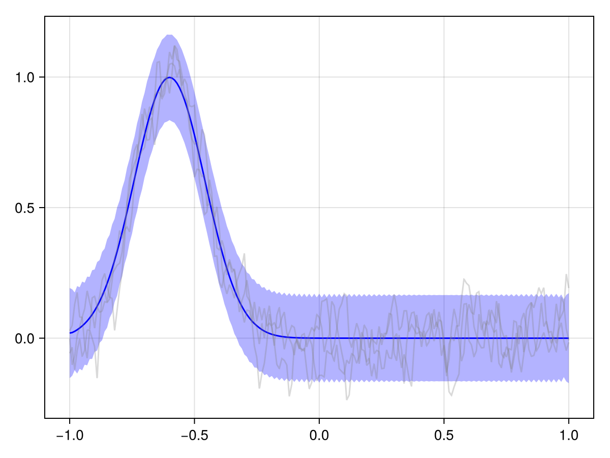
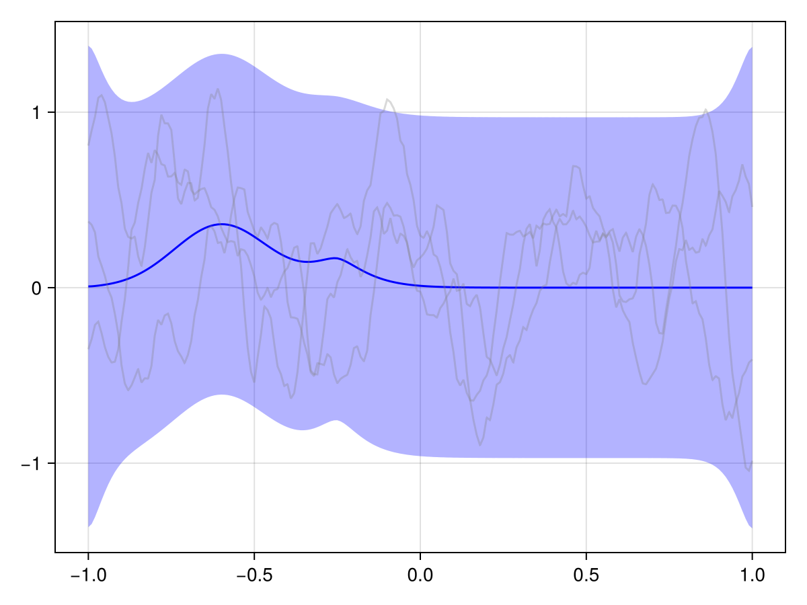
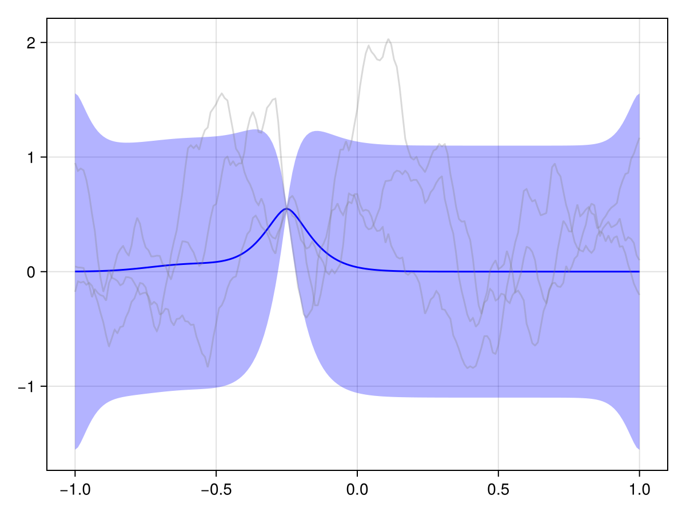
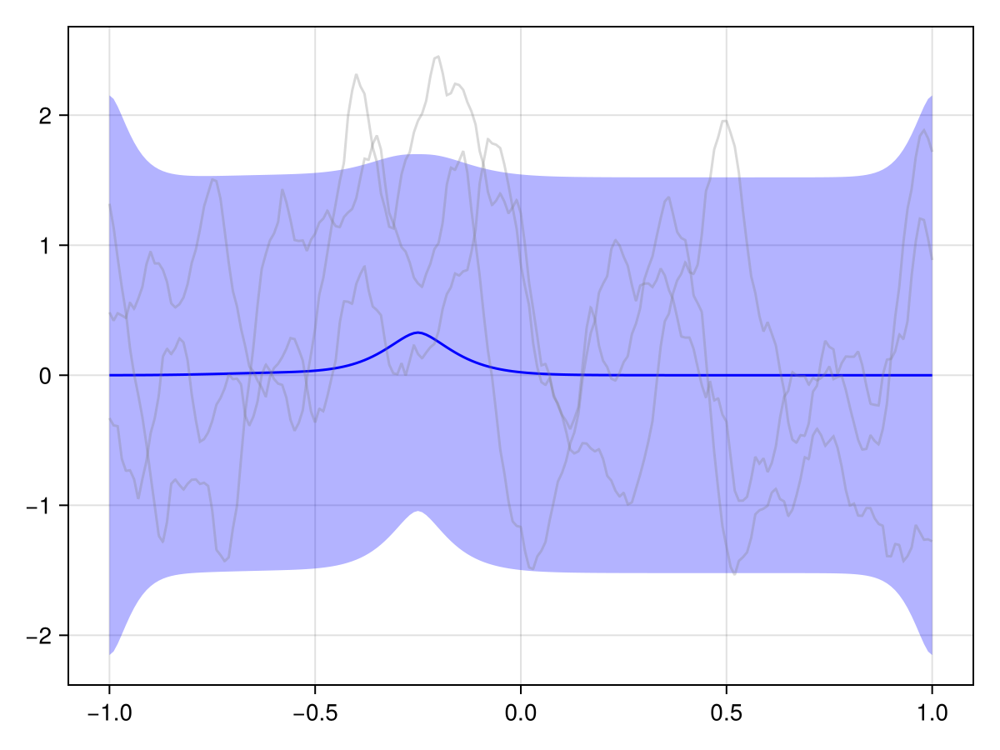
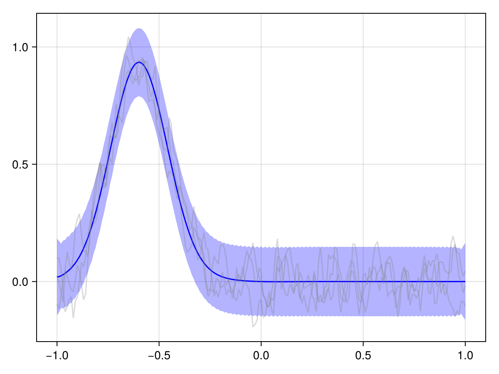
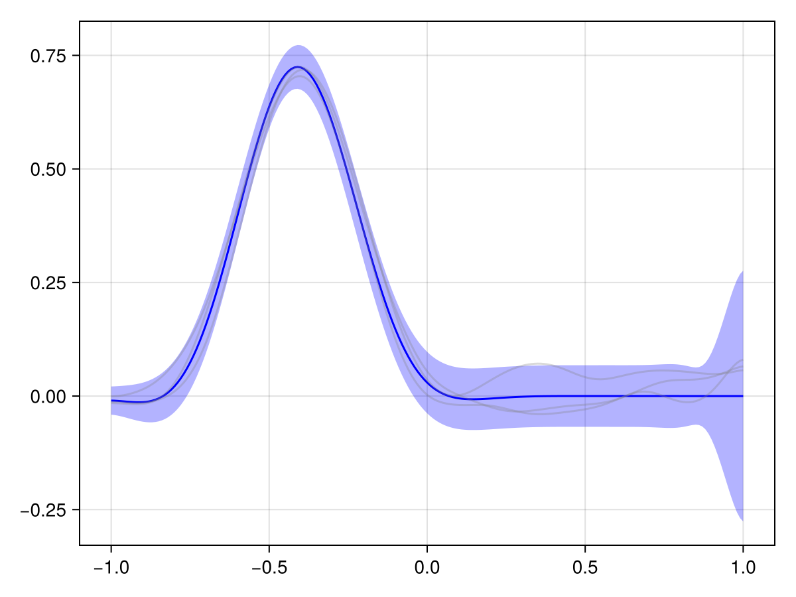
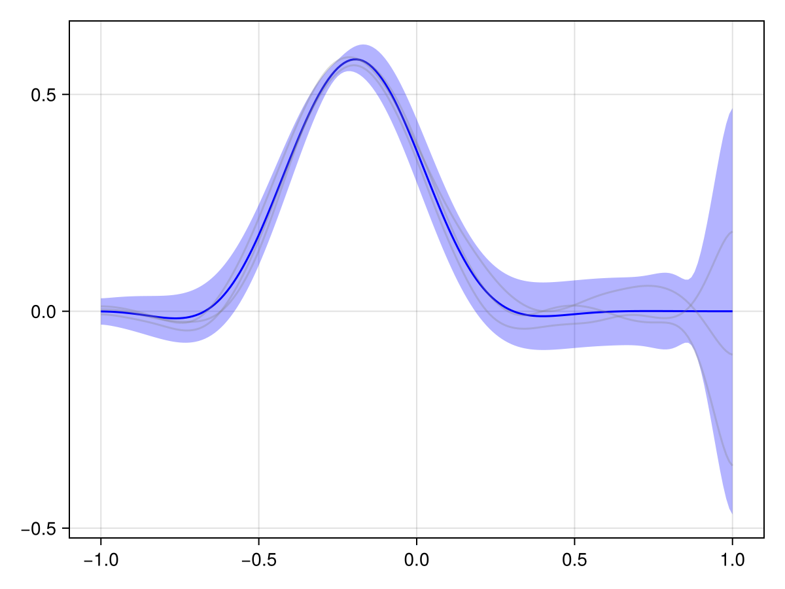
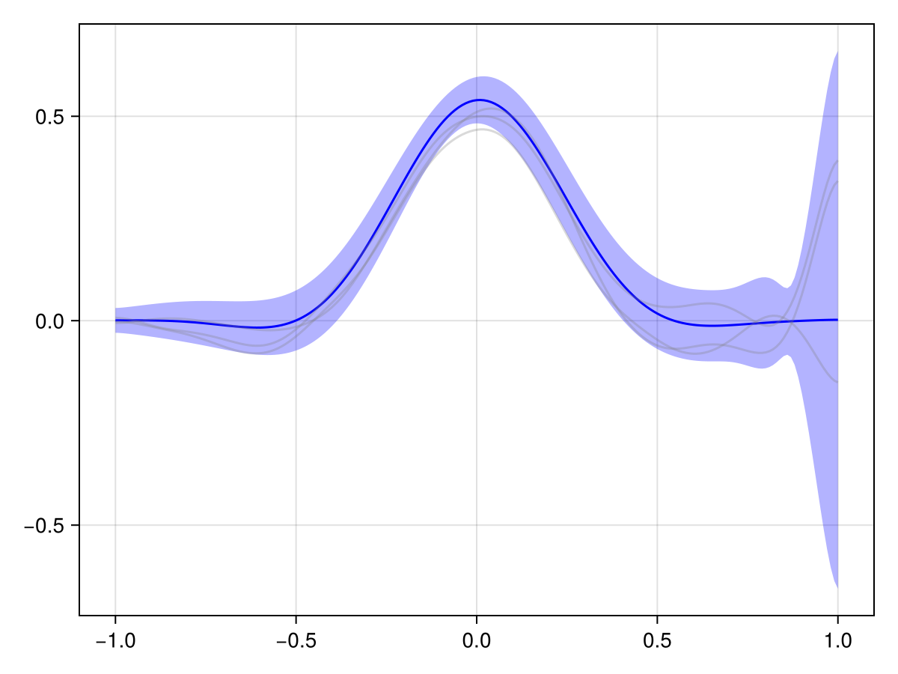

# Spatiotemporal Modelling with SPDEs {#Spatiotemporal-Modelling-with-SPDEs}

In this tutorial, we will demonstrate how to perform spatiotemporal Bayesian inference using GMRFs based on a simple toy example.

## Problem setup {#Problem-setup}

Our goal is to model how a pollutant (i.e. some chemical) spreads across a river over time. We get (noisy) measurements of the pollutant concentration across the domain at time t = 0, and an additional measurement at some later point in time. To simplify things, we model the river as a 1D domain. Let&#39;s set up the problem:

```julia
x_left, x_right = -1.0, 1.0
Nₓ = 201
t_start, t_stop = 0.0, 1.0
Nₜ = 71
ts = range(t_start, t_stop, length = Nₜ)
f_initial = x -> exp(-(x + 0.6)^2 / 0.2^2)
xs_initial = range(x_left, x_right, length = Nₓ ÷ 2)
ys_initial = f_initial.(xs_initial)
noise_precision_initial = 0.1^(-2)

x_later = -0.25
y_later = 0.55
noise_precision_later = 0.01^(-2)

xs_all = [xs_initial; x_later]
ys_all = [ys_initial; y_later]
N_obs_all = length(ys_all)
```


```ansi
101
```


## Using GMRFs for spatiotemporal modelling {#Using-GMRFs-for-spatiotemporal-modelling}

Fundamentally, we are interested in inferring a spatiotemporal function that models the pollutant concentration over time, which is an infinite-dimensional object. GMRFs, however, are finite-dimensional. This is not a limitation, it just means that we need to discretize space and time to ultimately obtain a discrete approximation to the infinite-dimensional object.

We&#39;re going to do this as follows:
1. Set up a stochastic PDE (SPDE) that models the spatiotemporal, infinite-dimensional prior (a Gaussian process).
  
2. Discretize the SPDE in space and time to obtain a GMRF which approximates the Gaussian process.
  
3. Condition the GMRF on the observations to obtain the posterior.
  

Let&#39;s start by setting up our discretizations:

```julia
using GaussianMarkovRandomFields
using Ferrite

grid = generate_grid(Line, (Nₓ - 1,), Tensors.Vec(x_left), Tensors.Vec(x_right))
interpolation = Lagrange{RefLine, 1}()
quadrature_rule = QuadratureRule{RefLine}(2)
disc = FEMDiscretization(grid, interpolation, quadrature_rule)
```


```ansi
FEMDiscretization
  grid: Grid{1, Line, Float64} with 200 Line cells and 201 nodes
  interpolation: Lagrange{RefLine, 1}()
  quadrature_rule: QuadratureRule{RefLine, Vector{Float64}, Vector{Vec{1, Float64}}}
  # constraints: 0

```


## A separable model {#A-separable-model}

Perhaps the simplest spatiotemporal model is a separable one, where the spatial and temporal components are independent. We can model both the spatial and temporal components using Matern processes:

```julia
spde_space = MaternSPDE{1}(range = 0.2, smoothness = 1, σ² = 0.3)
spde_time = MaternSPDE{1}(range = 0.5, smoothness = 1)
```


```ansi
MaternSPDE{1, Float64, Int64}(6.928203230275509, 3//2, 1.0, [1.0;;])
```


Discretize:

```julia
x_space = discretize(spde_space, disc)
Q_s = precision_map(x_space)

grid_time = generate_grid(Line, (Nₜ - 1,), Tensors.Vec(t_start), Tensors.Vec(t_stop))
disc_time = FEMDiscretization(grid_time, interpolation, quadrature_rule)
x_time = discretize(spde_time, disc_time)
Q_t = precision_map(x_time)
```


```ansi
71×71 LinearAlgebra.Symmetric{Float64, SparseArrays.SparseMatrixCSC{Float64, Int64}}:
   778.623  -1036.46     257.853  …       ⋅          ⋅          ⋅ 
 -1036.46    1815.1    -1036.46           ⋅          ⋅          ⋅ 
   257.853  -1036.46    1557.25           ⋅          ⋅          ⋅ 
      ⋅       257.853  -1036.46           ⋅          ⋅          ⋅ 
      ⋅          ⋅       257.853          ⋅          ⋅          ⋅ 
      ⋅          ⋅          ⋅     …       ⋅          ⋅          ⋅ 
      ⋅          ⋅          ⋅             ⋅          ⋅          ⋅ 
      ⋅          ⋅          ⋅             ⋅          ⋅          ⋅ 
      ⋅          ⋅          ⋅             ⋅          ⋅          ⋅ 
      ⋅          ⋅          ⋅             ⋅          ⋅          ⋅ 
     ⋮                            ⋱                            ⋮
      ⋅          ⋅          ⋅             ⋅          ⋅          ⋅ 
      ⋅          ⋅          ⋅             ⋅          ⋅          ⋅ 
      ⋅          ⋅          ⋅             ⋅          ⋅          ⋅ 
      ⋅          ⋅          ⋅     …       ⋅          ⋅          ⋅ 
      ⋅          ⋅          ⋅          257.853       ⋅          ⋅ 
      ⋅          ⋅          ⋅        -1036.46     257.853       ⋅ 
      ⋅          ⋅          ⋅         1557.25   -1036.46     257.853
      ⋅          ⋅          ⋅        -1036.46    1815.1    -1036.46
      ⋅          ⋅          ⋅     …    257.853  -1036.46     778.623
```


Create the separable spatiotemporal model:

```julia
x_st_kron = kronecker_product_spatiotemporal_model(Q_t, Q_s, disc)
```


```ansi
MetaGMRF{ConcreteSTMetadata}
  Inner GMRF: GMRF{Float64}(n=14271, alg=LinearSolve.DefaultLinearSolver)
  Metadata: ConcreteSTMetadata{1}(201 spatial × 71 time)
```


Great! Now let&#39;s condition on the observations. To do this, we construct a &quot;spatial&quot; observation matrix and transform it into a &quot;spatiotemporal&quot; observation matrix:

```julia
A_initial = evaluation_matrix(disc, [Tensors.Vec(x) for x in xs_initial])
t_initial_idx = 1 # Observe at first time point
A_initial = spatial_to_spatiotemporal(A_initial, t_initial_idx, Nₜ)
A_later = evaluation_matrix(disc, [Tensors.Vec(x_later)])
t_later_idx = 2 * Nₜ ÷ 3
A_later = spatial_to_spatiotemporal(A_later, t_later_idx, Nₜ)

A_all = [A_initial; A_later]

using LinearAlgebra, SparseArrays
Q_noise = sparse(I, N_obs_all, N_obs_all) * noise_precision_initial
Q_noise[end, end] = noise_precision_later
```


```ansi
10000.0
```


Condition on the observations:

```julia
x_st_kron_posterior = condition_on_observations(x_st_kron, A_all, Q_noise, ys_all)
```


```ansi
MetaGMRF{ConcreteSTMetadata}
  Inner GMRF: GMRF{Float64}(n=14271, alg=LinearSolve.DefaultLinearSolver)
  Metadata: ConcreteSTMetadata{1}(201 spatial × 71 time)
```


Let&#39;s look at the dynamics of this posterior.

```julia
using CairoMakie
CairoMakie.activate!()
plot(x_st_kron_posterior, t_initial_idx)
```

{width=1200px height=900px}

```julia
plot(x_st_kron_posterior, Nₜ ÷ 3)
```

{width=1200px height=900px}

```julia
plot(x_st_kron_posterior, 2 * Nₜ ÷ 3)
```

{width=1200px height=900px}

```julia
plot(x_st_kron_posterior, Nₜ)
```

{width=1200px height=900px}

We see that the effect of our observations effectively just &quot;dies off&quot; over time. And generally in spatiotemporal statistics, this is a fair assumption: The further away in time we are from an observation, the less it should influence our predictions.

But in our case, we know a bit more about the phenomenon at hand. This is a river, and we know that it flows in a certain direction, and we probably also roughly know the flow speed. We should embed this information into our prior to get a more useful posterior!

## Advection-diffusion priors {#Advection-diffusion-priors}

We can achieve this through a non-separable model that encodes these dynamics. Concretely, we are going to consider an advection-diffusion SPDE as presented in [[2](/bibliography#Clarotto2024)].

```julia
adv_diff_spde = AdvectionDiffusionSPDE{1}(
    γ = [-0.6],
    H = 0.1 * sparse(I, (1, 1)),
    τ = 0.1,
    α = 2 // 1,
    spatial_spde = spde_space,
    initial_spde = spde_space,
)
```


```ansi
AdvectionDiffusionSPDE{1}(1.0, 2//1, sparse([1], [1], [0.1], 1, 1), [-0.6], 1.0, 0.1, MaternSPDE{1, Float64, Int64}(17.32050807568877, 3//2, 0.3, [1.0;;]), MaternSPDE{1, Float64, Int64}(17.32050807568877, 3//2, 0.3, [1.0;;]))
```


To discretize this SPDE, we only need a FEM discretization of space. For time, we simply specify the discrete time points which are then used internally for an implicit Euler scheme.

```julia
x_adv_diff = discretize(adv_diff_spde, disc, ts)
```


```ansi
MetaGMRF{ImplicitEulerMetadata}
  Inner GMRF: GMRF{Float64}(n=14271, alg=LinearSolve.DefaultLinearSolver)
  Metadata: ImplicitEulerMetadata{1}(201 spatial × 71 time)
```


Condition on the initial observations:

```julia
x_adv_diff_posterior = condition_on_observations(x_adv_diff, A_all, Q_noise, ys_all)
```


```ansi
MetaGMRF{ImplicitEulerMetadata}
  Inner GMRF: GMRF{Float64}(n=14271, alg=LinearSolve.DefaultLinearSolver)
  Metadata: ImplicitEulerMetadata{1}(201 spatial × 71 time)
```


Let&#39;s look at the dynamics of this posterior.

```julia
plot(x_adv_diff_posterior, t_initial_idx)
```

{width=1200px height=900px}

```julia
plot(x_adv_diff_posterior, Nₜ ÷ 3)
```

{width=1200px height=900px}

```julia
plot(x_adv_diff_posterior, 2 * Nₜ ÷ 3)
```

{width=1200px height=900px}

```julia
plot(x_adv_diff_posterior, Nₜ)
```

{width=1200px height=900px}

This looks much more reasonable! We see that the pollutant is transported downstream over time, and the observations at the later time point are consistent with this.

## Conclusion {#Conclusion}

We have seen how to model spatiotemporal phenomena using GMRFs. We started with a simple separable model and then moved on to a more complex advection-diffusion model. The latter model was able to capture the dynamics of the river and the pollutant transport much better.

As mentioned initially, this was a simple toy example. But the underlying principles are the same for more complex problems. In particular, all of the above should work the same for arbitrary spatial meshes, as demonstrated e.g. in the tutorial [Spatial Modelling with SPDEs](/tutorials/spatial_modelling_spdes#Spatial-Modelling-with-SPDEs).


---


_This page was generated using [Literate.jl](https://github.com/fredrikekre/Literate.jl)._
